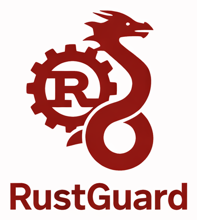
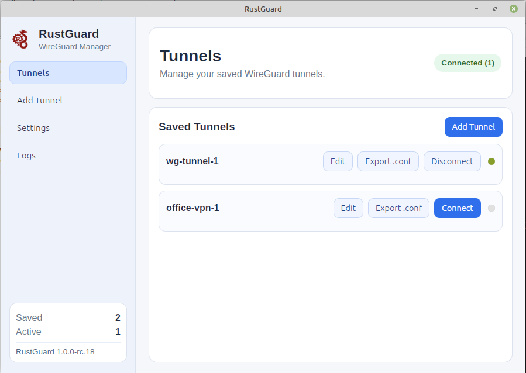

# RustGuard

RustGuard is a Rust-powered graphical client for Linux and Windows for managing and securing WireGuard VPN connections with performance, safety, and simplicity.



## Application identifiers

- Canonical application name: `net.websvc.rustguard`
- Linux settings folder: `~/.websvc/rustaguard`
- Windows settings folder: `%APPDATA%/WebSVC/rustaguard`

## Features





- Graphical desktop client implemented with Rust backend + Tauri frontend (HTML/CSS/JS)
- Custom application icon and dynamic tray status icon (black when disconnected, original bordeaux icon when connected)
- Settings panel:
  - Auto-start
  - Start minimized in system tray
  - Stable release update checks (manual and delayed startup check)
  - Multiple tunnels allow
- Tunnel management:
  - Save existing tunnel
  - Edit existing tunnel (name and config)
  - Add tunnel by importing a file
  - Add tunnel by defining tunnel name and pasting full configuration
- Logs viewer
- Close-to-tray behavior with explicit tray "Exit"
- Linux privilege elevation with startup authentication via `pkexec` launcher in `.deb` builds, plus sudo fallback paths

## Docker Compose development

Development should be done inside the Docker container.

Build the development image:

```bash
docker compose build dev
```

Run commands in the container (examples):

```bash
docker compose run --rm dev cargo build --manifest-path app/Cargo.toml
docker compose run --rm dev cargo test --all-targets --manifest-path app/Cargo.toml
docker compose run --rm dev cargo run --manifest-path app/Cargo.toml
docker compose run --rm dev cargo fmt --all --check --manifest-path app/Cargo.toml
docker compose run --rm dev cargo clippy --all-targets --all-features --manifest-path app/Cargo.toml -- -D warnings
docker compose run --rm dev cargo tauri dev --manifest-path app/Cargo.toml
docker compose run --rm dev ./scripts/build_linux.sh 1.2.3
docker compose run --rm dev ./scripts/build_windows.sh 1.2.3
docker compose run --rm dev ./scripts/build_release.sh 1.2.3 all
```

Note: `./scripts/build_release.sh <version> all` builds Linux and Windows in parallel.

If you run the raw binary directly on Linux, ensure Tauri runtime libraries are installed:

```bash
sudo apt-get update
sudo apt-get install -y libwebkit2gtk-4.1-0 libgtk-3-0
```

## CI/CD automation

- Tests and lint: `.github/workflows/ci.yml`
- Semantic version tagging on merge to master: `.github/workflows/version-tag.yml`
- Cross-platform builds and release publishing on tags: `.github/workflows/release.yml`
- Website deploy to GitHub Pages: `.github/workflows/pages.yml`

## Assets

- Repository/app preview image: `preview.png`
- Application icon: `app/Icon/rustguard_logo_original.png`
- Status/tray icons:
  - Disconnected (black): `app/Icon/rustguard_tray_idle.png`
  - Connected (bordeaux original): `app/Icon/rustguard_tray_active.png`
- Tunnel status dots (list view):
  - Disconnected: `app/ui/assets/dot-gray.png`
  - Connected: `app/ui/assets/dot-green.png`
